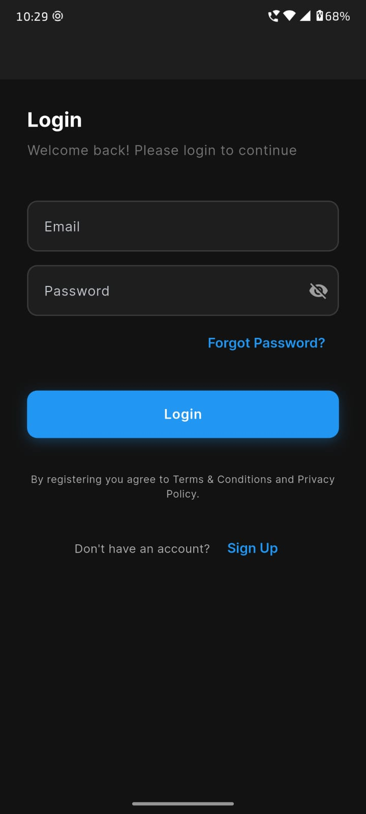

# HandyPro - Multi-Vendor Handyman & Home Services UI Showcase



[](https://flutter.dev)
[](https://dart.dev)
[](https://riverpod.dev)
[](https://m3.material.io)
[](LICENSE)

> [!IMPORTANT]
> **UI-ONLY SHOWCASE**: This project is a high-fidelity UI/UX showcase for a multi-vendor handyman marketplace. It is built to demonstrate modern mobile design patterns and Flutter's UI capabilities. It does **not** include a functional backend or business logic.

**HandyPro** is a premium Flutter UI kit designed for a multi-vendor handyman and home services marketplace. It offers a seamless, modern experience for users to discover and browse home services with a focus on visual excellence and intuitive navigation.

---

## ✨ UI Highlights

- 📱 **Premium UI/UX**: Built with Material Design 3, featuring vibrant colors and smooth transitions.
- 🌓 **Dark Mode Support**: Fully theme-aware components for both light and dark modes.
- 🌍 **Localized Interface**: Ready for multi-language support (English & Hindi implemented).
- 🧩 **Reusable Components**: A rich library of custom widgets and layout patterns.
- 🚀 **Clean Architecture**: Organized using a feature-first approach for easy exploration.

---

## 📸 App Showcase

### Core Experience
| Onboarding | Home Screen | Service Details |
| :---: | :---: | :---: |
|  |  |  |

### Booking & Management
| Select Worker | Bookings List | Booking Detail |
| :---: | :---: | :---: |
|  | .jpeg) |  |

### Profile & Settings
| User Profile | Settings | Theme Selection |
| :---: | :---: | :---: |
|  |  |  |

### Additional Screens
| Search | Notifications | Wallet |
| :---: | :---: | :---: |
| .jpeg) | .jpeg) | .jpeg) |

---

## 🚀 Features (UI Implemented)

- **🔐 Auth Flow**: Splash, Onboarding, Login, and OTP screens.
- **🏠 Home**: Location picker, search bar, offer banners, and service categories.
- **🔍 Search**: Recent searches, filters, and result listings.
- **📅 Bookings**: Tabbed booking history and detailed progress tracking.
- **👤 Profile**: Account management, addresses, payment methods, and settings.

---

## 🛠️ Tech Stack

- **Framework**: [Flutter](https://flutter.dev)
- **State Management**: [Riverpod](https://riverpod.dev) (UI State)
- **Navigation**: [go_router](https://pub.dev/packages/go_router)
- **UI Components**: Material 3, [flutter_svg](https://pub.dev/packages/flutter_svg), [lottie](https://pub.dev/packages/lottie)
- **Localization**: [easy_localization](https://pub.dev/packages/easy_localization)

---

## 🔧 Exploring the UI

### 1. Prerequisites
- Flutter SDK (v3.0.0+)

### 2. Setup
```bash
# Clone the repository
git clone https://github.com/your-username/handypro.git

# Install dependencies
flutter pub get

# Run the app
flutter run
```

---

## 📁 Project Structure

```
lib/
├── core/               # UI Theme, Routing, and Shared Widgets
├── features/           # UI Modules (Auth, Home, Booking, etc.)
└── main.dart           # App Entry Point
```

---

## 🌍 Localization

The app currently supports:
- 🇺🇸 English (en)
- 🇮🇳 Hindi (hi)

---

## 📄 License

This project is licensed under the MIT License - see the [LICENSE](LICENSE) file for details.

---

Built with ❤️ by the HandyPro Team.
